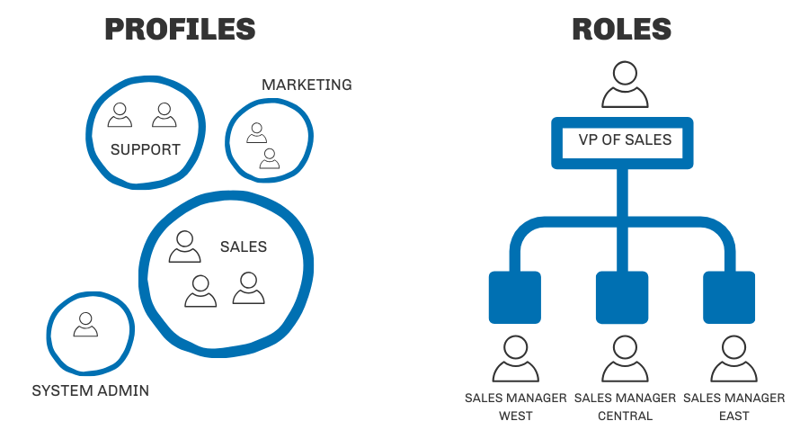

# User Hierachy 
A user-role relationship tool for showing hiearchy of users and roles



----
### How to run this python app?

0. Setup: Clone Git Repo

1. Edit the `roles.json` and `users.json` file in the Input folder, or use the existing sample json files

2. Install Python Dependencies
```sh
python -m pip install -r requirements.txt
```

3. Run process to load all the tables
```sh
python -m hierarchy -r ./Input/roles.json -u ./Input/users.json
```
4. Test the process to check the logic
```sh
python ./hierarchy/test.py
```
----

### Dockerize
0. Setup: Clone Git Repo

1. Edit the `roles.json` and `users.json` file in the Input folder, or use the existing sample json files

2. Build docker image
```sh
docker build . -t user-hierarchy:latest
```

3. Run docker image
```sh
docker run user-hierarchy:latest
```


### Sample json file
Sample json file for roles:
```json
[
  {
    "Id": 1,
    "Name": "System Administrator",
    "Parent": 0
  },
  {
    "Id": 2,
    "Name": "Location Manager",
    "Parent": 1
  },
  {
    "Id": 3,
    "Name": "Supervisor",
    "Parent": 2
  },
  {
    "Id": 4,
    "Name": "Employee",
    "Parent": 3
  },
  {
    "Id": 5,
    "Name": "Trainer",
    "Parent": 3
  }
]
```

Sample json file for users:
```json
[
  {
    "Id": 1,
    "Name": "Adam Admin",
    "Role": 1
  },
  {
    "Id": 2,
    "Name": "Emily Employee",
    "Role": 4
  },
  {
    "Id": 3,
    "Name": "Sam Supervisor",
    "Role": 3
  },
  {
    "Id": 4,
    "Name": "Mary Manager",
    "Role": 2
  },
  {

    "Id": 5,
    "Name": "Steve Trainer",
    "Role": 5
  }
]
---

